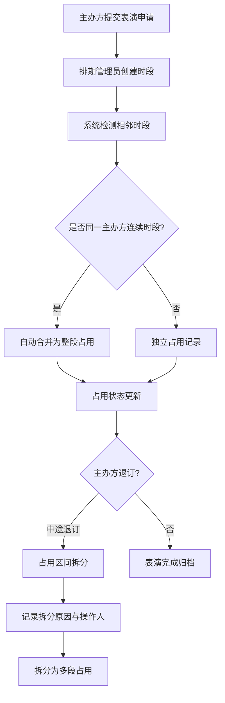
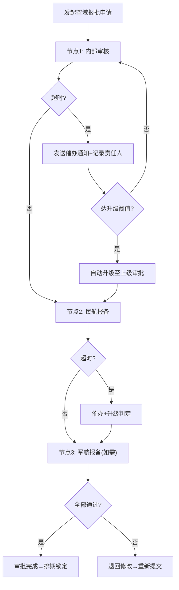

## 1. 产品概述

无人机表演排期管理系统，面向文旅活动、商业演出、城市节庆等场景，提供无人机编队表演的全流程排期、审批与合规管理。解决表演时段冲突、相邻时段合并优化、报批流程节点失控等痛点。

- **核心问题**：人工排期效率低、时段冲突难发现、审批节点超时无人追踪、占用拆分操作繁琐
- **目标用户**：排期管理员、表演主办方、空域审批员、运营督查岗
- **市场价值**：将排期效率提升60%，审批超时率降低80%，占用合并准确率100%

## 2. 核心功能

### 2.1 用户角色

| 角色 | 注册方式 | 核心权限 |
|------|----------|----------|
| 排期管理员 | 系统注册 | 机阵建档、排期创建与编辑、占用合并与拆分、审批发起 |
| 表演主办方 | 系统注册 | 查看排期、提交表演申请、确认占用时段、退订操作 |
| 空域审批员 | 系统注册 | 审批报批申请、查看审批轨迹、退回修改 |
| 运营督查 | 系统注册 | 超时催办监控、审批流程审计、责任人记录查询 |
| 系统管理员 | 系统注册 | 角色权限配置、超时规则设置、系统参数管理 |

### 2.2 功能模块

1. **表演排期模块**：机阵建档、排期日历视图、表演时段创建、冲突检测
2. **占用合并拆分模块**：相邻时段自动合并、占用区间人工拆分、合并/拆分日志
3. **报批审批模块**：空域审批报备、多级审批流程、审批轨迹留痕、审批状态看板
4. **超时催办模块**：节点超时计时、自动升级规则、催办通知推送、责任人记录

### 2.3 页面详情

| 页面名称 | 模块名称 | 功能描述 |
|----------|----------|----------|
| 控制台仪表盘 | 全局概览 | 今日表演统计、待审批数量、超时预警、机阵利用率KPI卡片 |
| 机阵建档管理 | 表演排期 | 无人机编队信息录入、规模/型号/性能参数、机阵状态管理 |
| 排期日历 | 表演排期 | 周/月视图日历、拖拽创建表演时段、冲突高亮、筛选条件 |
| 表演时段详情 | 表演排期 | 表演信息编辑、主办方关联、机阵分配、空域范围设置 |
| 占用合并列表 | 占用合并拆分 | 相邻时段检测列表、一键合并、合并预览、合并历史 |
| 占用拆分操作 | 占用合并拆分 | 占用区间可视化、时间轴拖拽拆分点、拆分原因记录 |
| 审批流程配置 | 报批审批 | 多级审批节点定义、审批人分配、超时阈值设置 |
| 报批申请列表 | 报批审批 | 报批单列表、状态筛选、批量操作、导出功能 |
| 审批轨迹详情 | 报批审批 | 时间轴展示审批全流程、各节点处理意见、附件查看 |
| 超时催办中心 | 超时催办 | 超时节点看板、倒计时显示、催办按钮、升级处理 |
| 催办记录审计 | 超时催办 | 催办历史查询、责任人追踪、自动升级日志 |
| 空域报备管理 | 报批审批 | 空域坐标绘制、报备文件上传、民航/军航报备状态 |

## 3. 核心流程

### 3.1 表演排期与占用合并流程

主办方提交表演申请后，排期管理员创建表演时段，系统自动检测相邻时段是否可合并。同一主办方连续时段自动合并为整段占用，退订时触发拆分逻辑。

### 3.2 报批审批与超时催办流程

排期确认后发起空域报批，各审批节点限时处理。超时未处理时系统自动发送催办通知，达到升级阈值时自动上报上级并记录责任人。

## 4. 用户界面设计

### 4.1 设计风格

- **主色调**：深空蓝 `#0A1628` 作为主背景，航空蓝 `#1E40AF` 作为主色，科技青 `#06B6D4` 作为强调色，警戒橙 `#F97316` 标识超时预警
- **辅助色**：成功绿 `#10B981`、危险红 `#EF4444`、信息紫 `#8B5CF6`
- **按钮风格**：扁平化+细边框，圆角8px，hover态微放大+发光效果，关键操作按钮带脉冲动画
- **字体方案**：标题使用 Rajdhani 窄体工业风字体，正文使用 Inter，数字/编码使用 JetBrains Mono 等宽字体
- **布局风格**：侧边栏导航+顶部状态栏+主内容区三栏布局，卡片式容器，深色科技感毛玻璃效果
- **图标风格**：线性图标统一2px描边，航空航天相关icon增强场景感

### 4.2 页面设计概述

| 页面名称 | 模块名称 | UI元素 |
|----------|----------|--------|
| 控制台仪表盘 | 全局概览 | 网格布局KPI卡片、实时数据趋势图、雷达图机阵状态、甘特图当日排期 |
| 排期日历 | 表演排期 | 日历网格+时间轴Gantt双视图、拖拽创建、冲突红色高亮边框、合并时段渐变背景 |
| 占用合并列表 | 占用合并拆分 | 表格+时间轴可视化、可合并时段青绿色标识、一键合并按钮带确认弹窗 |
| 占用拆分操作 | 占用合并拆分 | 横向时间轴组件、拖拽拆分锚点、拆分预览阴影、原因表单抽屉 |
| 审批流程配置 | 报批审批 | 节点卡片拖拽排序、连线动画、阈值滑块、审批人选择器 |
| 报批申请列表 | 报批审批 | 数据表格+状态Badge、进度条显示当前节点、批量操作工具栏 |
| 审批轨迹详情 | 报批审批 | 垂直时间轴、节点状态图标、处理意见气泡、附件缩略图网格 |
| 超时催办中心 | 超时催办 | 卡片网格、每个节点带倒计时环、警戒色渐变、催办按钮脉冲动画 |
| 机阵建档管理 | 表演排期 | 卡片列表+无人机3D轮廓图、参数标签、状态灯、规模数量统计环 |

### 4.3 响应式设计

- **桌面优先**：1440px及以上为标准设计稿，最小支持1024px
- **平板适配**：侧边栏可折叠为图标模式，卡片网格自动降列
- **触控优化**：触摸目标最小44x44px，日历单元格可放大，时间轴支持手势捏合缩放

### 4.4 视觉动效设计

- **入场动画**：页面加载时各模块从下往上错位浮现，stagger延迟80ms
- **微交互**：按钮hover轻微上浮+发光，卡片hover边框渐亮，切换标签时内容淡入滑动
- **状态变化**：审批节点通过时绿勾绘制动画，超时时红色脉冲呼吸灯
- **数据更新**：KPI数字滚动动画，甘特图时段新增时从左向右滑入展开
- **背景氛围**：顶部导航栏底部蓝色发光渐变，全局微弱网格纹理，深色模式下更有层次
