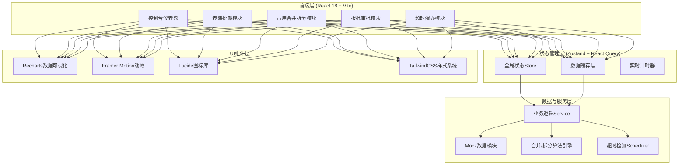

## 1. 架构设计



## 2. 技术说明

- **前端框架**：React 18.2 + TypeScript 5 + Vite 5
- **构建工具**：Vite 5 (初始化命令: `npm create vite@latest . -- --template react-ts`)
- **样式方案**：TailwindCSS 3.4 + CSS变量主题系统
- **状态管理**：Zustand 4.5 (轻量全局Store) + React Query (服务端状态缓存)
- **路由**：React Router DOM 6
- **数据可视化**：Recharts 2.12 (KPI趋势、甘特图、雷达图)
- **动效库**：Framer Motion 11 (入场动画、微交互、过渡效果)
- **图标**：Lucide React 0.395
- **日期工具**：date-fns 3
- **后端**：无后端，使用Mock数据模块模拟服务端交互
- **数据持久化**：localStorage 模拟数据库存储

## 3. 路由定义

| 路由路径 | 页面组件 | 用途 |
|----------|----------|------|
| `/dashboard` | DashboardPage | 控制台仪表盘 - KPI概览、数据趋势、当日排期 |
| `/fleet` | FleetManagementPage | 机阵建档管理 - 无人机编队信息维护 |
| `/schedule` | ScheduleCalendarPage | 排期日历 - 周/月视图、时段创建管理 |
| `/schedule/:id` | ScheduleDetailPage | 表演时段详情 - 时段信息编辑、机阵分配 |
| `/occupancy/merge` | OccupancyMergePage | 占用合并列表 - 相邻时段检测与合并 |
| `/occupancy/split` | OccupancySplitPage | 占用拆分操作 - 时间轴拖拽拆分 |
| `/approval/config` | ApprovalConfigPage | 审批流程配置 - 节点定义、阈值设置 |
| `/approval/list` | ApprovalListPage | 报批申请列表 - 报批单管理 |
| `/approval/:id` | ApprovalTrackPage | 审批轨迹详情 - 全流程时间轴 |
| `/reminder/center` | ReminderCenterPage | 超时催办中心 - 超时节点看板 |
| `/reminder/audit` | ReminderAuditPage | 催办记录审计 - 责任人追踪 |
| `/airspace/report` | AirspaceReportPage | 空域报备管理 - 报备文件与状态 |

## 4. 数据模型 (TypeScript 类型定义)

```typescript
// ===== 机阵相关 =====
interface DroneFleet {
  id: string;
  name: string;
  droneCount: number;
  droneModel: string;
  maxAltitude: number;
  maxFlightTime: number;
  status: 'available' | 'in_use' | 'maintenance';
  location: string;
  createdAt: string;
}

// ===== 表演排期相关 =====
interface PerformanceSlot {
  id: string;
  title: string;
  organizerId: string;
  organizerName: string;
  fleetId: string;
  fleetName: string;
  startTime: string;
  endTime: string;
  status: 'draft' | 'confirmed' | 'approved' | 'completed' | 'cancelled';
  airspaceArea: string;
  estimatedAttendance: number;
  description?: string;
  occupancyId?: string;
  createdAt: string;
  updatedAt: string;
}

// ===== 占用相关 =====
interface OccupancyBlock {
  id: string;
  organizerId: string;
  organizerName: string;
  fleetId: string;
  startTime: string;
  endTime: string;
  slotIds: string[];
  isMerged: boolean;
  mergedFromIds?: string[];
  status: 'active' | 'split' | 'cancelled';
  createdAt: string;
}

interface MergeLog {
  id: string;
  mergedOccupancyId: string;
  sourceOccupancyIds: string[];
  operatorId: string;
  operatorName: string;
  operationTime: string;
  remark?: string;
}

interface SplitLog {
  id: string;
  sourceOccupancyId: string;
  resultOccupancyIds: string[];
  splitPoint: string;
  operatorId: string;
  operatorName: string;
  reason: string;
  operationTime: string;
}

// ===== 审批相关 =====
interface ApprovalNode {
  id: string;
  name: string;
  order: number;
  assigneeId: string;
  assigneeName: string;
  timeoutHours: number;
  escalateAfterHours: number;
  escalationTargetId?: string;
}

interface ApprovalFlow {
  id: string;
  name: string;
  nodes: ApprovalNode[];
  isActive: boolean;
}

interface ApprovalRequest {
  id: string;
  slotId: string;
  slotTitle: string;
  flowId: string;
  currentNodeOrder: number;
  status: 'pending' | 'approved' | 'rejected' | 'escalated';
  submissionTime: string;
  timeline: ApprovalTrackItem[];
  attachments: string[];
}

interface ApprovalTrackItem {
  id: string;
  nodeId: string;
  nodeName: string;
  operatorId: string;
  operatorName: string;
  action: 'submit' | 'approve' | 'reject' | 'escalate' | 'remind';
  comment?: string;
  timestamp: string;
  isTimeout?: boolean;
}

// ===== 超时催办相关 =====
interface ReminderRecord {
  id: string;
  approvalRequestId: string;
  nodeId: string;
  nodeName: string;
  assigneeId: string;
  assigneeName: string;
  deadline: string;
  reminderTime: string;
  isAuto: boolean;
  isEscalation: boolean;
  operatorId?: string;
  operatorName?: string;
  status: 'sent' | 'delivered' | 'read';
}

// ===== 空域报备相关 =====
interface AirspaceReport {
  id: string;
  slotId: string;
  coordinates: { lat: number; lng: number }[];
  altitudeRange: { min: number; max: number };
  civilAviationStatus: 'pending' | 'submitted' | 'approved' | 'rejected';
  militaryAviationStatus: 'not_required' | 'pending' | 'submitted' | 'approved' | 'rejected';
  reportNumber?: string;
  documents: { name: string; url: string; type: string }[];
  createdAt: string;
}

// ===== 主办方相关 =====
interface Organizer {
  id: string;
  name: string;
  contactPerson: string;
  contactPhone: string;
  contactEmail: string;
  companyType: string;
  qualificationLevel: 'A' | 'B' | 'C';
}

// ===== 用户相关 =====
interface User {
  id: string;
  name: string;
  role: 'admin' | 'scheduler' | 'organizer' | 'approver' | 'auditor';
  email: string;
  phone: string;
  department?: string;
}
```

## 5. 核心算法模块说明

### 5.1 占用合并算法

```
输入: 所有表演时段列表 PerformanceSlot[]
处理逻辑:
  1. 按机阵维度分组 (fleetId)
  2. 每组内按 startTime 升序排序
  3. 遍历检测相邻时段:
     - 当前时段.endTime == 下一时段.startTime
     - 且 organizerId 相同
     - 且 status 均为 confirmed/approved
  4. 满足条件则标记为可合并候选组
  5. 合并操作: 创建新 OccupancyBlock (isMerged=true, slotIds=[])
  6. 记录 MergeLog
输出: 合并建议列表 + 执行合并
```

### 5.2 占用拆分算法

```
输入: 原占用ID + 拆分时间点 splitPoint
处理逻辑:
  1. 校验 splitPoint 在原占用 [startTime, endTime] 区间内
  2. 将 slotIds 按时间点拆分:
     - 时段完全在 splitPoint 之前 → 前段占用
     - 时段完全在 splitPoint 之后 → 后段占用
     - 跨 splitPoint 的时段 → 拆分为两个 PerformanceSlot
  3. 创建两个新 OccupancyBlock
  4. 原占用 status = 'split'
  5. 记录 SplitLog (含原因与操作人)
输出: 拆分后的两个占用记录
```

### 5.3 超时检测引擎

```
轮询频率: 每60秒
检测逻辑:
  1. 获取所有 pending 状态的审批节点
  2. 计算 剩余时间 = 提交时间 + timeoutHours - 当前时间
  3. 剩余时间 ≤ 0 → 标记为超时
     - 创建 ReminderRecord (isAuto=true)
     - 检查是否达 escalateAfterHours
       - 是 → 创建升级 ReminderRecord + 状态改为 escalated
       - 否 → 仅发送催办
  4. 每次操作记录责任人
输出: 催办通知 + 状态更新 + 审计记录
```

## 6. 目录结构设计

```
src/
├── assets/              # 静态资源 (字体、图片)
├── components/          # 通用组件
│   ├── layout/          # 布局组件 (Sidebar, Header, AppLayout)
│   ├── ui/              # 基础UI (Button, Card, Modal, Badge)
│   ├── charts/          # 图表封装
│   ├── timeline/        # 时间轴组件
│   └── schedule/        # 排期相关组件
├── pages/               # 页面组件 (与路由一一对应)
├── store/               # Zustand Store
│   ├── fleetStore.ts
│   ├── scheduleStore.ts
│   ├── occupancyStore.ts
│   ├── approvalStore.ts
│   ├── reminderStore.ts
│   └── userStore.ts
├── services/            # 业务逻辑层
│   ├── mergeService.ts
│   ├── splitService.ts
│   ├── timeoutService.ts
│   └── mockApi.ts
├── types/               # TypeScript类型定义
│   └── index.ts
├── data/                # Mock数据
│   ├── mockFleet.ts
│   ├── mockSchedule.ts
│   ├── mockApproval.ts
│   └── mockUsers.ts
├── hooks/               # 自定义Hooks
│   ├── useCountdown.ts
│   ├── useTimeout.ts
│   └── useAnimation.ts
├── utils/               # 工具函数
│   ├── dateUtils.ts
│   ├── colorUtils.ts
│   └── formatters.ts
├── styles/              # 全局样式与主题
│   ├── globals.css
│   └── theme.ts
├── router/              # 路由配置
│   └── index.tsx
├── App.tsx
└── main.tsx
```

## 7. 全局主题变量 (TailwindCSS)

```css
:root {
  --color-bg-primary: #0A1628;
  --color-bg-secondary: #0F1F38;
  --color-bg-card: rgba(15, 31, 56, 0.7);
  --color-bg-hover: rgba(30, 64, 175, 0.15);
  --color-primary: #1E40AF;
  --color-primary-light: #3B82F6;
  --color-accent: #06B6D4;
  --color-warning: #F97316;
  --color-success: #10B981;
  --color-danger: #EF4444;
  --color-info: #8B5CF6;
  --color-text-primary: #F1F5F9;
  --color-text-secondary: #94A3B8;
  --color-text-muted: #64748B;
  --color-border: rgba(148, 163, 184, 0.15);
  --color-border-light: rgba(148, 163, 184, 0.08);
  --shadow-glow-primary: 0 0 20px rgba(30, 64, 175, 0.4);
  --shadow-glow-accent: 0 0 20px rgba(6, 182, 212, 0.4);
  --shadow-glow-warning: 0 0 20px rgba(249, 115, 22, 0.5);
}
```
